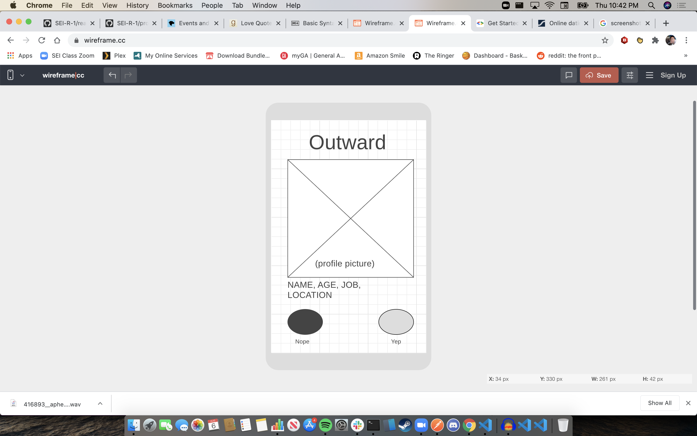

# dating-app-project
A dating app matching system pulling data and profile pictures and setting them in a template to be swiped on. 

As a dating app user, and someone fascinated by multi-faceted applications coming together to form a cogent product, I was drawn to the idea of building a dating app. 

Dating apps are actually multiple applications running scynchronously with each other to form a single program. There is the initial set-up: logging in, creating a profile, and answering questions that carve out your space in the algorithm to be sent potential matches. Then, there is a matching game, which is what this project intends to be, where you are sent profiles to potential matches and you either "like" them or "pass" on them. Then, there is a messaging program that allows two users to communicate with each other. Within each of those applications are a number of features, but this project is focused on the middle step and what I think is the core UX of any dating app: liking people you like and passing on those that you don't.

In 2019, 30.4 million users logged in to date online, and 25.1m of them did so from their smartphones. This project's layout has been designed with a mobile screen in mind. 

>"Love does not consist of gazing at each other, but in looking *outward* together in the same direction."

>-Antoine de Saint-Exupéry

I am happy to present to you: **Outward**.

# User Stories:

<ul>
    <li>As a user (AAU), I expect to see a large, clearly visible photo when a new profile loads.</li>
    <li>AAU, I expect to be able to choose or reject a profile I see, and have the next profile load in promptly.</li>
    <li>AAU, I expect to be able to check on and message profiles I have matched with.</li>
</ul>

# Prototype

# Technologies Used:

<ul>
    <li>HTML</li>
    <li>CSS</li>
    <li>JavaScript</li>
</ul>

# Getting Started:

# Next Steps and Icebox Item:

<ul>
    <li>Add Google Maps API functionality to display a match's distance from a user's declared location using modulus operator to round to the nearest mile. </li>
    <li>Add an undo button that brings back the prior profile and removes the yep/nope designation on the profile, so that users can change their mind on accidental swipes.</li>